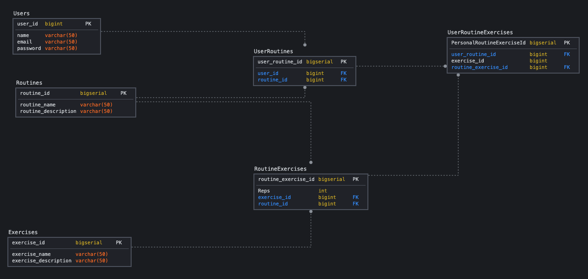
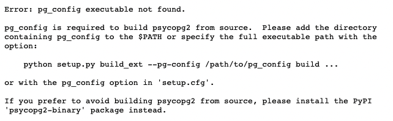

# Workout Tracker API

## Purpose
Purpose of this project is to create an API that allows for workout tracking/keeping a log of workouts categorized in different routines, primarily using Python Flask.

## Technology
- Python
- Python Flask
- PostgreSQL
- Jenkins
- AWS

## Thought Process while building:
1. To first start creating this application I came up with a potential db schema. 
    

2. Next I searched for a python library to allow me to create tables and perform queries. This led me to [Python Flask SQL Alchemy](https://flask-sqlalchemy.palletsprojects.com/en/2.x/)
Which is an extension of flask that allows for SQLAlchemy support thus allowing for object relational mapping with a SQL database. 

3. Thanks to SQLAlchemy it allows me to declare tables as Python classes, thus allowing me to create methods and functions to effectively manipulate my database, with the ease of Python.
    ```
    class User(db.Model):
        user_id = db.Column(db.Integer, primary_key=True)
        user_name = db.Column(db.String(50), unique=True, nullable=False)
        name = db.Column(db.String(50), nullable=False)
        email = db.Column(db.String(50), nullable=False)
        routines = db.relationship('User_Routines', backref='user', lazy=True)
        password = db.Column(db.String(100), nullable=False)


        def __init__(self,data):
            self.name = data.get('name')
            self.user_name = data.get('user_name')
            self.email = data.get('email')
            self.password = data.get('password')

        def __repr__(self):
            return '<User %r>' % self.name

        def save_to_db(self):
            db.session.add(self)
            db.session.commit()
            print('Saving to db')

        @staticmethod
        def select_all():
            user_query = User.query.all()
            response = []
            #returns an array of all User objects
            for user_obj in user_query:
                response.append({
                    'user_id':user_obj.user_id,
                    'user_name':user_obj.user_name,
                    'name':user_obj.name,
                    'email':user_obj.email
                })

            return response
    ```

4. Once my database tables are declared I begun working on the actual routes with Python flask. 

5. Python flask allows for a modular project environment through the use of blueprints. I defined my routes through the use of blueprints. 
    ```
    # api/routes/routines.py
    bp = Blueprint('routines', __name__, url_prefix='/routines')

    def add_routine(req):
        routine_dict = {
            "routine_name": req["routine_name"],
            "routine_description": req["routine_description"]
        }

        try:
            saved_routine = Routines(routine_dict)
            current_routine_id = saved_routine.save_routine()
            return current_routine_id
        except:
            return 'Error saving'

    @bp.route('/', methods=["GET"])
    def get_routines():
        # possibly return all user submitted routines
        try:
            return {
                "all_routines": Routines.get_all_routines()
            }, 200
        except:
            return {
                "error": "Error occurred retrieving data from DB"
            }, 400

    #get routines for specific user 
    @bp.route('/<int:user_id>', methods=["GET"])
    def get_user_routines(user_id):
        current_user = User.find_user_by_id(user_id)

        if current_user is False:
            return {
                "error": "User with that ID not found"
            }, 400

        else:
            return {
                "user":user_id,
                "user_routine":current_user.get_routines()
            },200

    #get specific routine with exercises for a particular user 
    ```

6. After a blueprint is defined you can import it into the main python flask application file.
    ```
    # api/__init__.py
    app.register_blueprint(routines.bp)

    ```
7. Through the use of flask blueprints and flask SQLAlchemy I was able to create API routes that allows for:
    - The sign up of new users 
    - Ability to create a new routine associated with a particular user 
    - Able to add exercises to a particular routine containing exercise name, description, and amount of reps
    - Able to retrieve all exercises associated with a particular routine
    - Ability to delete a routine and have that routine deletion cascade down to other tables

## Troubleshooting Elastic Beanstalk Deployment
1. Make sure your requirements.txt file is always up to date. I forgot to update my requirements file with new packages that I installed thus resulting in elastic bean stalk failing. This was only fixed after digged through the logs.
    

2. If you're using environmental variables make sure to set those in the elastic beanstalk environment configuration. 

3. Also if you're using psycopg2 it may result in an error, thus requiring you to install the binary. 
    

4. Make sure application.py is in root of the directory.


## How to run
1. Add a .env file to the root of the directory with the following contents
    ```
    DEBUG=True
    FLASK_ENV=development
    FLASK_APP=api
    LOCAL_DB_URI=url to your pg db
    ```
2. Set up a python virtual environment in the root of the cloned repository.
```
$ python3 -m venv venv
$ . venv/bin/activate
$ pip install -r requirement.txt
```

3. Now in the terminal enter:
    ```
    $ flask run
    ```

## Features that still need to be added
- Recording completed workouts on different days 
- Implementing delete and update routes for routines and exercises
- Implement an AWS production database.